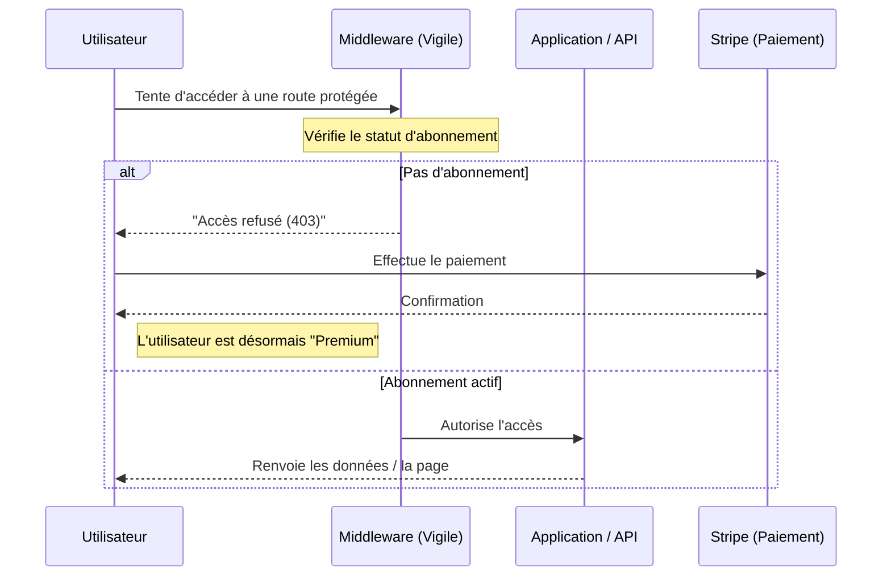

# 💳 Le principe des Abonnements

Ce document explique comment l'application gère l'accès aux fonctionnalités "Premium".

### 🛡️ Le "Vigile" (Middleware)
Le système d'abonnement fonctionne comme un vigile à l'entrée d'un club privé :
- Avant d'exécuter une action, l'application vérifie si l'utilisateur a son "badge" (un abonnement actif).
- Si l'utilisateur n'est pas abonné, le vigile lui barre la route et lui demande de s'abonner.

### 📊 Schéma du fonctionnement

### 📍 Où est-ce utilisé ?
Pour l'instant, la sécurité est activée sur **l'API** (les données brutes du projet). 
- **Accès public :** Naviguer sur le site, voir les films.
- **Accès Premium (API) :** Récupérer la liste détaillée des lieux via des outils externes.

### ⚙️ Comment ça marche (en résumé)
1. **L'Abonnement :** Géré par Stripe. Une fois que le paiement est validé, l'utilisateur reçoit le statut "abonné" dans la base de données.
2. **Le Contrôle :** On utilise un mot-clé appelé `subscribed` sur les routes que l'on veut protéger.
3. **Le Blocage :** Si quelqu'un tente d'accéder à une route protégée sans payer, l'application renvoie une erreur de type "Accès refusé".

### 💡 Pourquoi faire ça ?
Cela permet de séparer ce qui est **gratuit** pour attirer les utilisateurs de ce qui est **payant** pour rentabiliser l'application (comme l'utilisation de l'Intelligence Artificielle ou l'accès aux données précises).
